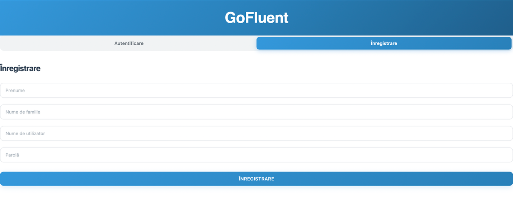
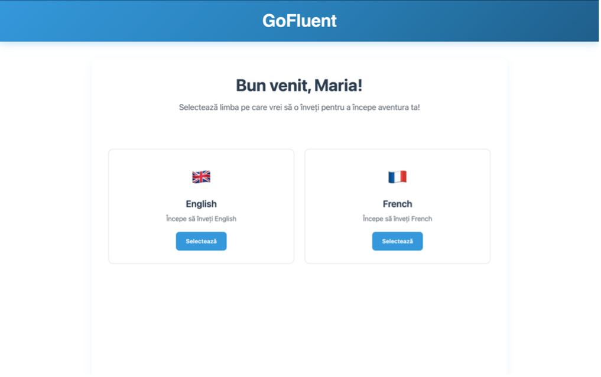
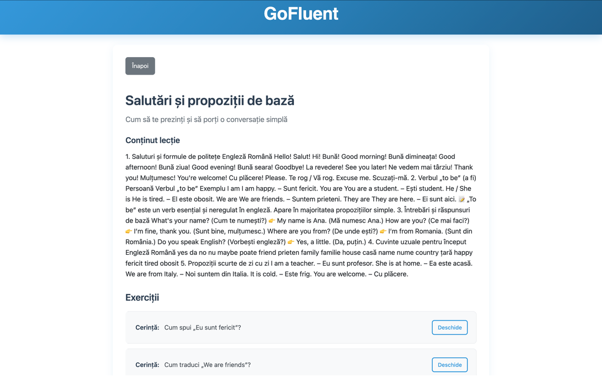
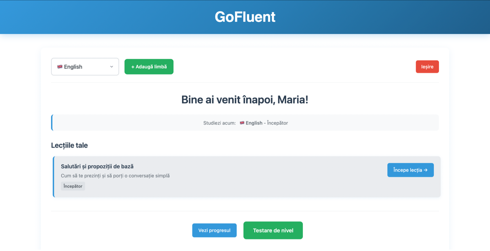
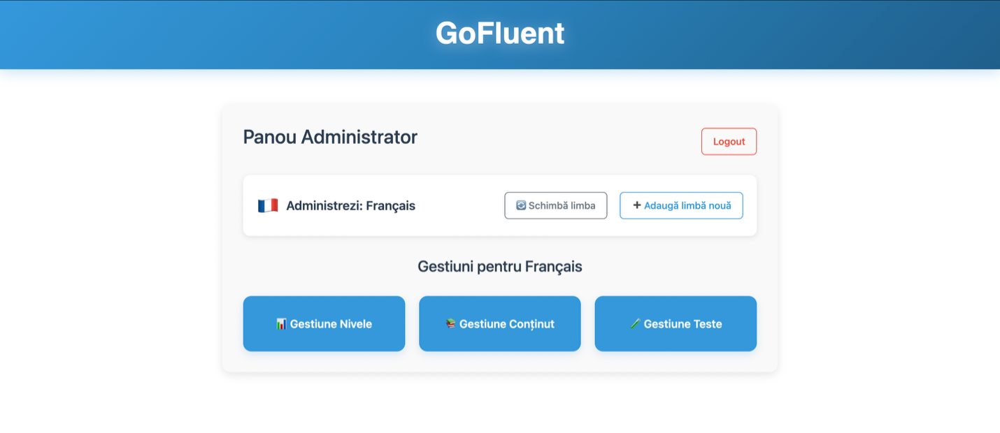
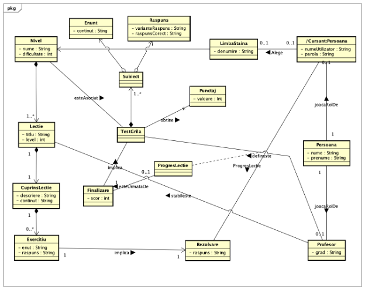

# GoFluent

## 🔧 Tech Stack

A web application for foreign language learning, inspired by Duolingo, built with **Angular** and **Spring Boot**.  
This project helps users study foreign languages through structured lessons, interactive quizzes, gamification, and progress tracking.

---

## ✅ Main Features

- ✅ User authentication and registration  
- ✅ **New user onboarding** — first-time users must choose a learning language  
- ✅ **Existing user flow** — returning users are redirected to their first selected language  
- ✅ Lessons organized by levels  
- ✅ Interactive quizzes with answer validation  
- ✅ Progress tracking  
- ✅ Admin panel  
- ✅ REST API backend consumed by the Angular frontend  

---

## 🏛️ Architecture

**Angular Frontend → REST API → Spring Boot → PostgreSQL**

---

## 🛠️ Technologies & Versions

### **Frontend (Angular)**

- **Angular Framework:** 16.2.12  
- **Angular CLI:** 16.2.16  
- **Node.js:** 20.19.0  
- **npm:** 11.6.2  
- **TypeScript:** 5.1.6  
- **RxJS:** 7.8.2  
- **Zone.js:** 0.13.3  

### **Backend (Spring Boot)**

- **Spring Boot:** 3.3.3  
- **Java:** 21  
- **Spring Web**  
- **Spring Security**  
- **Spring Data JPA**  
- **Lombok:** 1.18.30  
- **MapStruct:** 1.5.3.Final  
- **Auth0 Java JWT:** 4.3.0  

---

## 📸 Screenshots

### 🔵 New User Flow

#### 1. Register Page  

#### 2. New User Homepage (no learning language selected yet)  

#### 3. Lesson Page  

---

### 🟢 Existing User Flow

#### Existing User Homepage  

---

### 🔧 Admin Panel

---

## 📘 Class Diagram (Main Entities)

---
